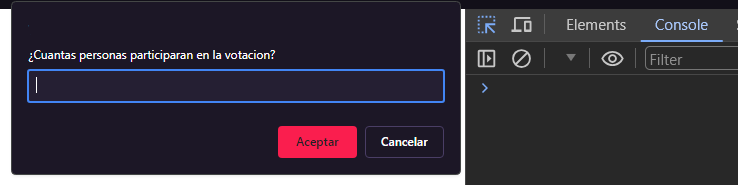

# Proyecto Modulo 2 Sistema de Votacion

Proyecto realizado en Javascript, el fin es el desarrollo de un algoritmo que represente un sistema de votacion creado por el usuario. El algoritmo tiene que considerar los siguientes requerimientos:

## Requerimientos del proyecto

 - Permitir a los usuarios crear encuestas con opciones de respuesta.
 - Permitir a los usuarios votar en las encuestas.
 - Mostrar los resultados de las encuestas en tiempo real.
 - Almacenar los datos de las encuestas y los votos en una variable.
 - Implementar la solución utilizando programación orientada a objetos (POO) o programación funcional (PF).

 ## Mi proyecto

Mi algoritmo está pensado un sistema de votación en el que se puede escoger la cantidad de participantes y la cantidad de preguntas a realizar, cada una de las preguntas tiene un enunciado y tres alternativas que igualmente pueden ser elegidas por el usuario. Las alternativas elegidas por cada participante pasan a ser parte de la información del mismo, esta condición permite hacer el conteo final de votos y desplegar los resultados al final del algoritmo.

## Implementación con Promt()

Dentro de los requerimientos del proyecto no se encuentra una forma para ingresar los datos de entrada, este proyecto utiliza el comando prompt() de JavaScript para interactuar con el usuario, y todos los datos serán visualizados en la consola del navegador.



# Funcionamiento de la solución de programación orientada a objetos (POO)

## Propósito de cada clase

Dentro del algoritmo existen 5 clases que dividen el proceso del programa en 5 secciones.

 - Inscripción
 - Preguntas
 - Votación
 - Resultados
 - Mostrar resultados

 ## Inscripción

Clase Persona
 
 - Esta clase añade un método llamado inscribirse que será utilizado en la herencia a la clase Participante.
 - El funcionamiento del método inscribirse contempla la posibilidad de errores y previene que el usuario ingrese valores que compliquen el funcionamiento del algoritmo.
 - Finalmente el método crea una nueva instancia de participante que el cual hereda dicho método y datos del constructor de la clase persona, esta nueva instancia es almacenada en un arreglo que contendrá a cada objeto Participante, considero necesario el uso de push dado que la cantidad de participantes es dinámica y puede pueden ser los que el usuario quiera.

 ```
class Persona {
    constructor(name,age,sexo,pais){
        this.name = name;
        this.age = age;
        this.sexo = sexo;
        this.pais = pais;
    }
    inscribirse (){
        let personas = prompt("¿Cuantas personas participaran en la votacion?");
        while (isNaN(personas) || personas == "") {
            alert("Introduce un numero valido");
            personas = prompt("¿Cuantas personas participaran en la votacion?");
        };
        for (let i = 1; i <=personas;i++) {
            let name = prompt("Nombre del participante "+ i);
            let age = prompt("Edad del participante "+ i);
            let sexo = prompt("Sexo del participante "+ i);
            let pais = prompt("Pais del participante "+ i);
            while (name == "" || age == "" || sexo == "" || pais == "") {
                alert("Ningun dato puede estar vacio");
                name = prompt("Nombre del participante "+ i);
                age = prompt("Edad del participante "+ i);
                sexo = prompt("Sexo del participante "+ i);
                pais = prompt("Pais del participante "+ i);
            };
            participantes.push(new Participante(name,age,sexo,pais));
        };
    };
};
```
 ## Preguntas

 Clase Pregunta

 - Esta clase añade un método llamado preguntas que será utilizado para crear las preguntas
 - El funcionamiento del método preguntas contempla la posibilidad de errores y previene que el usuario ingrese valores que compliquen el funcionamiento del algoritmo impidiendo la
 existencia de un enunciado vacío o alternativas vacías.
 - Finalmente el método crea una nueva instancia de Pregunta, esta nueva instancia es almacenada en un arreglo que contendrá a cada objeto Pregunta, considero necesario el uso de push dado que la cantidad de preguntas es dinámica y puede pueden ser los que el usuario quiera.

 ```
class Pregunta {
    constructor(pregunta,opciones){
        this.pregunta = pregunta;
        this.opciones = opciones ;
    };

    preguntas (){
        let question = prompt("¿Cuantas preguntas quiere hacer?");
        while (isNaN(question) || question == "") {
            alert("Introduce un numero valido");
            question = prompt("¿Cuantas preguntas quiere hacer?");
        };
        for (let i = 1; i <=question;i++) {
            let opciones = [];
            let pregunta = prompt("Enunciado de la pregunta "+ i);
            while (pregunta == "") {
                alert("El enunciado no puede estar vacio");
                pregunta = prompt("Enunciado de la pregunta "+ i);
            };
            let opcion1 = prompt("Opcion 1");
            let opcion2 = prompt("Opcion 2");
            let opcion3 = prompt("Opcion 3");
            while (opcion1 == "" || opcion2 == "" || opcion3 == "") {
                alert("Ninguna de las opciones puede estar vacia")
                opcion1 = prompt("Opcion 1");
                opcion2 = prompt("Opcion 2");
                opcion3 = prompt("Opcion 3");
            };
            opciones.push(opcion1,opcion2,opcion3);
            preguntas.push(new Pregunta(pregunta,opciones));
        };
    };
};
```
## Votacion

Clase Participante

 - Esta clase hereda las características dela clase persona y su método inscribirse el cual es usado para generar nuevas instancias de sí misma.
 - Añade un método llamado votar que será utilizado para añadir el voto a cada elemento del arreglo Participantes en cada iteración.
 - El funcionamiento del método votar contempla la posibilidad de errores y previene que el usuario ingrese valores que no existan dentro de cada elemento del arreglo preguntas,
 impidiéndole avanzar hasta que ingrese una alternativa existente.

```
class Participante extends Persona{
    constructor(name,age,sexo,pais,votos){
        super(name,age,sexo,pais);
        this.votos = votos;
    };

    votar (){
        for (let i = 0; i < participantes.length; i++) {
            let votosPush = [];
            for (let j = 0; j < preguntas.length; j++) {
                alert("Encuesta participante " + (i + 1) );
                alert(preguntas[j].pregunta.toUpperCase());
                let votoEntrada = prompt(preguntas[j].opciones.join(' - ')) ;
                while (!preguntas[j].opciones.includes(votoEntrada)) {
                    alert("Introduce una opcion valida");
                    votoEntrada = prompt(preguntas[j].opciones.join(' - '));
                };
                votosPush.push(votoEntrada);
            };
            participantes[i].votos = votosPush;
        };
    };
};
```
 ## Resultados

Clase resultados
 -
 - Esta clase contiene la estructura de cada resultado por pregunta, almacenando el enunciado y cada alternativa con sus correspondientes cantidades de votos.
 - Añade un método llamado resultados, el cual repasa el arreglo de preguntas almacenando el enunciado y alternativas de cada elemento inicializando las cantidades de votos en 0.
 posteriormente repasa el arreglo de participantes, distinguiendo cada caso según su elección y sumando 1 a dicha elección en su resultado.
 - Finalmente el método crea una nueva instancia de Resultado, esta nueva instancia es almacenada en un arreglo que contendrá a cada objeto Resultado, considero necesario el uso de push dado que la cantidad de resultados es dinámica y varían según la cantidad de preguntas.

 ```
class Resultado {
    constructor(enunciado,eleccion1,cantidad1,eleccion2,cantidad2,eleccion3,cantidad3){
      this.enunciado = enunciado;
      this.alternativa1 = {eleccion1, cantidad1};
      this.alternativa2 = {eleccion2, cantidad2};
      this.alternativa3 = {eleccion3, cantidad3};
    };

    resultados(){
        for (let i = 0; i < preguntas.length; i++) {
          let enunciado = preguntas[i].pregunta;
          let eleccion1, eleccion2, eleccion3;
          let cantidad1, cantidad2, cantidad3;
          cantidad1 = 0;
          cantidad2 = 0;
          cantidad3 = 0;
          preguntas[i].opciones.forEach((index) => {
            switch (index) {
              case 0:
                eleccion1 = (`${opcion}`);
                break;
              case 1:
                eleccion2 = (`${opcion}`);
                break;
              case 2:
                eleccion3 = (`${opcion}`);
                break;
              default:
                break;
            };
          });
          participantes.forEach((votos,index) => {
            switch ((participantes[index].votos[i])) {
              case eleccion1:
                cantidad1++;
                break;
              case eleccion2:
                cantidad2++;
                break;
              case eleccion3:
                cantidad3++;
                break;
              default:
                break;
            };
          });  
          resultados.push(new Resultado(enunciado,eleccion1,cantidad1,eleccion2,cantidad2,eleccion3,cantidad3));
        };
    };
};
```
## Administración y resultados

Clase Administración
 -
 - Esta clase no contiene una estructura como tal, su lavor es representar mediante metodos la administracion de las demas clases como lo haria la gestion de un meson de una votacion.
 - iniciarPlantilla crea un "participante0" que sera el que inicie el metodo inscribirse de su clase.
 - iniciarPreguntas crea un "pregunta0" que sera el que inicie el metodo preguntas de su clase.
 - iniciarVotacion crea un "participante0" que sera el que inicie el metodo votar de su clase.
 - iniciarResultados crea un "result0" que sera el que inicie el metodo resultados de su clase.
 - mostrarResultados recorre el arreglo de resultados y en cada iteracion genera la tabla de resultados de cada pregunta.
   
 ```
class Administracion {
    iniciarPlanilla (){
        const participante0 = new Participante();
        participante0.inscribirse();
    };

    iniciarPreguntas (){
        const pregunta0 = new Pregunta ();
        pregunta0.preguntas();
    };

    iniciarVotacion (){
        const participante0 = new Participante();
        participante0.votar();
    };

    iniciarResultados (){
        const result0 = new Resultado();
        result0.resultados();
    };
    
    mostrarResultados (){
        resultados.forEach(resultado => {
            console.log("==================================");
            console.log("Enunciado: " + resultado.enunciado);
            console.log("alternativa1: " + resultado.alternativa1.eleccion1 + " fue de " + resultado.alternativa1.cantidad1 + " votos");
            console.log("alternativa2: " + resultado.alternativa2.eleccion2 + " fue de " + resultado.alternativa2.cantidad2 + " votos");
            console.log("alternativa3: " + resultado.alternativa3.eleccion3 + " fue de " + resultado.alternativa3.cantidad3 + " votos");
            console.log("==================================");
        });
    };
};
```
## Constantes globales e iniciar métodos

 - Constantes principales y inicio de los métodos de Administración mediante la nueva instancia de admin dando inicio al algoritmo
 ```
const preguntas = [];
const participantes = [];
const resultados = [];
const admin = new Administracion();
admin.iniciarPlanilla();
admin.iniciarPreguntas();
admin.iniciarVotacion();
admin.iniciarResultados();
admin.mostrarResultados();

 ```

# Funcionamiento de la solución de programación funcional (PF)

## Propósito de cada función

Dentro de algoritmo distingo cada funcion segun su proposito, los cuales son:

 - Validación
 - Generar
 - Recopilar

 El criterio para distinguir cada propósito corresponde a lo que espero de cada función más que su nombre en sí, ya que este nombre corresponde más a su uso en el algoritmo que a su 
 propósito explicativo en este readme. Las funciones implementadas cumplen con los criterios de la programación funcional.

 - Validación: El propósito de estas funciones son retornar un valor booleano, este valor permite acceder a los bucles cuando se ingresa un valor erróneo.
 - Generar: El propósito de estas funciones es retornar una estructura básica de un objeto literal, para su posterior ingreso a otras funciones.
 - Recopilar: El propósito de estas funciones es retornar parámetros de la misma con otra estructura, para su posterior ingreso a otras funciones.

## Funciones de validación

Retornar Booleano

Cada una de estas funciones serán llamadas según se necesiten dentro del cuerpo principal del algoritmo, dando la entrada a bucles si es necesario que el usuario reingrese
los datos sin errores.
```
function validarNumero(numero) {
   if (isNaN(numero) || numero == "") {
        return true;
   } else {
        return false;
   };
};
function validarDatos(dato1,dato2,dato3,dato4) {
    if (dato1 == "" || dato2 == "" || dato3 == "" || dato4 == "") {
        return true;
   } else {
        return false;
   };
}
function validarEnunciado(enunciado) {
    if (enunciado == "") {
        return true;
   } else {
        return false;
   };
}
function opcionesValidas(opcion1,opcion2,opcion3) {
    if (opcion1 == "" || opcion2 == "" || opcion3 == "" ) {
        return true;
    } else {
        return false;
    }
}
function validarOpciones (voto,indice) {
   if (preguntas[indice].opciones.includes(voto)) {
        return false;
    } else {
        return true;
    };
};
```
## Funciones de generación

Retornar objetos

Ambas funciones serán llamadas al final de ingreso principal de datos, utilizándose en la iteración de participantes y preguntas, dado que el usuario puede elegir la cantidad de
participantes y de preguntas al inicio del algoritmo.
```
const generarPregunta = (pregunta,opciones) =>{
    return {
        pregunta,
        opciones,
    };
};
const generarParticipante = (name, age, gender, country) => {
    return {
      name,
      age,
      gender,
      country,
      
    };
};  
```
## Funciones de recopilar

Retornar nuevos arrays u objetos

Como fue mencionado anteriormente estas funciones toman un grupo de parámetros y retornan un arreglo o un objeto, su funcionamiento se verá en el cuerpo principal el algoritmo.
```
const recopilarVotos = (...votos) => {
    return votos.reduce((arregloAcumulador, votos) => {
      return [...arregloAcumulador, votos];
    }, []);
};
function contarVotos(arr) {
    return arr.reduce((ocurrencias, elemento) => {
        return { ...ocurrencias, [elemento]: (ocurrencias[elemento] || 0) + 1 };
    }, {});
};
function soloOpciones(participantes) {
    return participantes.map(participante => participante.votos).flat();
};

```
## Cuerpo del algoritmo

La estructura del algoritmo consiste en bucles donde toman lugar las funciones ya vistas, la implementación es similar a la solución en POO pero se cambia el paradigma al Funcional.
Cada función es utilizada según se van necesitando ya sea para entrar en bucles de validación o al final de los bucles que iteran la cantidad de preguntas y participantes, retornando arreglos o objetos sin modificar los datos que se le entregan, cumpliendo la condición de pureza.
```
const participantes = [];
const preguntas = [];

let personas = prompt("Cuantas personas participan");
while (validarNumero(personas)) {
    alert("Introduce numero valido");
    personas = prompt("¿Cuantas personas participaran en la votacion?");
    validarNumero(personas);
};

let preguntasAHacer = prompt("Numero de preguntas a hacer");
while (validarNumero(preguntasAHacer)) {
    alert("Introduce un numero valido");
    preguntasAHacer = prompt("Numero de preguntas a hacer");
    validarNumero(preguntasAHacer);
};

for (let i = 1; i <= parseInt(personas) + parseInt(preguntasAHacer); i++) {

    if (i <= personas ) {
        let name = prompt("Nombre del participante "+ i);
        let age = prompt("Edad del participante "+ i);
        let gender = prompt("Genero del participante "+ i);
        let country = prompt("Pais del participante "+ i);
        while (validarDatos(name,age,gender,country)) {
        alert("Ningun dato puede estar vacio");
        name = prompt("Nombre del participante "+ i);
        age = prompt("Edad del participante "+ i);
        gender = prompt("Genero del participante "+ i);
        country = prompt("Pais del participante "+ i);
        };
        participantes.push(generarParticipante(name,age,gender,country));
    };
    
    if (i > personas && i <= parseInt(personas) + parseInt(preguntasAHacer)) {
        let pregunta = prompt("Enunciado de la pregunta "+ (i-personas));
        while (validarEnunciado(pregunta)) {
            alert("El enunciado no puede estar vacio");
            pregunta = prompt("Enunciado de la pregunta "+ (i-personas));
            validarEnunciado(pregunta);
        };
        let opcion1 = prompt("Opcion 1");
        let opcion2 = prompt("Opcion 2");
        let opcion3 = prompt("Opcion 3");
        while (opcionesValidas(opcion1,opcion2,opcion3)) {
            alert("Ninguna de las opciones puede estar vacia")
            opcion1 = prompt("Opcion 1");
            opcion2 = prompt("Opcion 2");
            opcion3 = prompt("Opcion 3");
            opcionesValidas(opcion1,opcion2,opcion3);
        };
        preguntas.push(generarPregunta(pregunta,recopilarVotos(opcion1,opcion2,opcion3)));
    };
};
for (let i = 0; i < participantes.length; i++) {
    let votosPush = [];
    for (let j = 0; j < preguntas.length; j++) {
        alert("Encuesta participante " + (i + 1));
        alert(preguntas[j].pregunta.toUpperCase());
        let votoEntrada = prompt(preguntas[j].opciones.join(' - '));
        while (validarOpciones(votoEntrada,j)) {
            alert("Introduce una opcion valida");
            votoEntrada = prompt(preguntas[j].opciones.join(' - '));
            validarOpciones(votoEntrada,j);
        };
        votosPush.push(votoEntrada);
    };
    participantes[i].votos = votosPush;
};
```
## Final del algoritmo

Acá vemos la función final que sirve para mostrar los datos en iteración, esta función no retorna ningún valor, sin embargo no es necesario dado que su propósito es mostrar la tabla de resultados al final del algoritmo.
```
function mostrarResultados(resultados) {
    console.log("===========================================");
    console.log("TABLA DE RESULTADOS");
    console.log("OPCIONES ESCOGIDAS FUERON:");
    return Object.entries(resultados).map(resultado => {
       return console.log("Alternativa " + resultado[0] + " obtuvo : " + resultado[1] + " votos");
    });
};
mostrarResultados(contarVotos(soloOpciones(participantes)));
```

### Notas:

- El uso de prompt puede no ser la forma más adecuada de hacer ingreso de datos, pero considerando las limitaciones del proyecto y el hecho que aún no iniciamos como tal el modulo
 de HTML, me parece el recurso indicado para dar una interacción mínima al algoritmo.


Gracias por leer las notas.